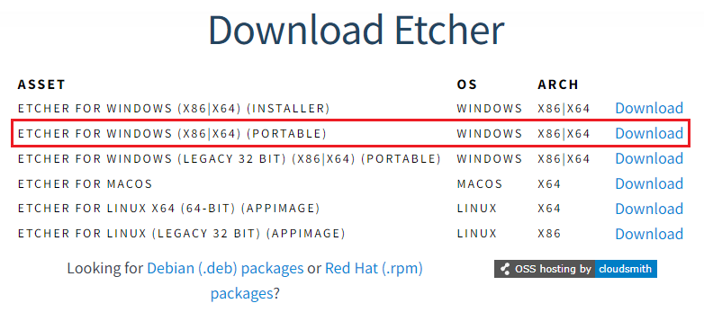
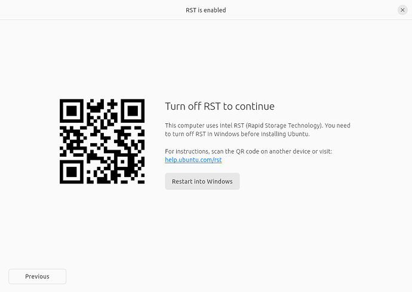
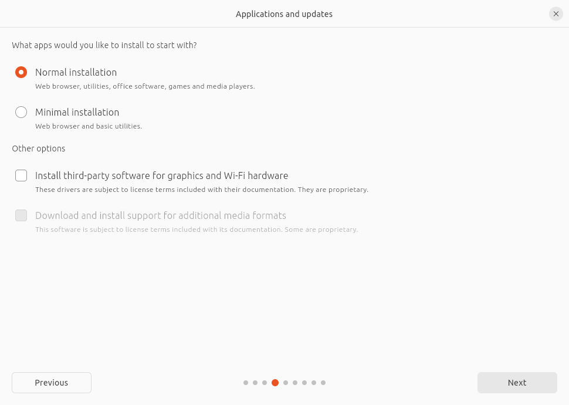
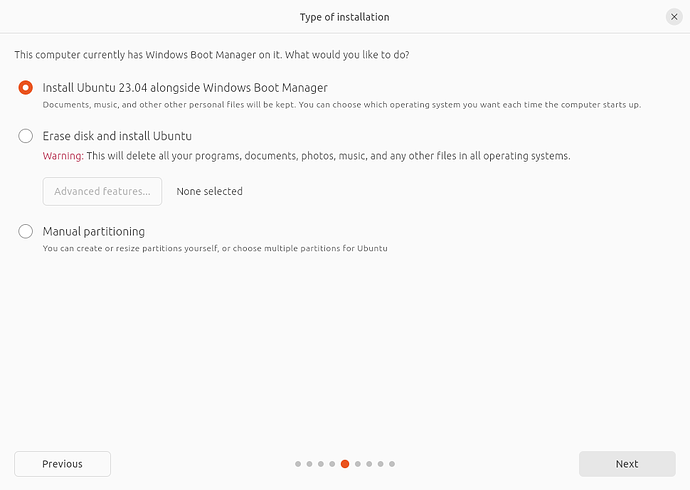
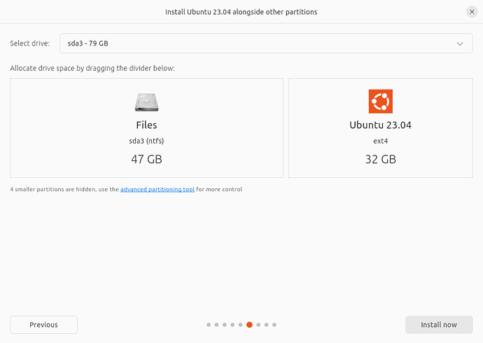
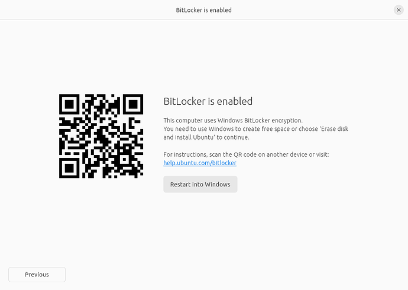

[Home](../index.md)

# [Install Ubuntu desktop](#install-ubuntu-desktop)

__Table of Contents__
* TOC
{:toc}

This guide is for installing Ubuntu desktop on a computer that already has Windows 10 (or Windows 11) installed.

## [Prerequisites](#prerequisites)

- A computer with Windows 10 (or Windows 11) installed and at least 25GB of free space.
- A USB drive (12GB or above recommended).
- A working internet connection.
- A backup is recommended before proceeding.

## [1. Download Ubuntu desktop](#1-download-ubuntu-desktop)

Download the latest version of **Ubuntu 22.04 desktop** from [here](https://ubuntu.com/download/desktop).

## [2. Create a bootable USB drive](#2-create-a-bootable-usb-drive)

We will use balenaEtcher to create a bootable USB drive. Download balenaEtcher from [here](https://www.balena.io/etcher/).
Download the portable version if you do not want to install it.

There are also guides for using Rufus [here](https://ubuntu.com/tutorials/create-a-usb-stick-on-windows#1-overview).

Select your downloaded ISO, choose your USB flash drive, and then click Flash! to install your image.

## [3. Boot from USB](#3-boot-from-usb)

- Insert the USB flash drive into the laptop or PC you want to install Ubuntu and boot or restart the device.

- You will need to access the boot menu to select the USB drive as the boot device. The key to access the boot menu varies depending on the manufacturer of the device.
The key is usually F12, F10, F2, or Esc.
*If you are unsure, you can search for the key for your device online.*
- Once the installer has initialised you will be presented with the option to try Ubuntu or install Ubuntu. Select Install Ubuntu.
- Select your keyboard layout and click Continue. If you are unsure, select Detect Keyboard Layout. You will be asked to press a few keys so that Ubuntu can detect your keyboard layout.

### [3.1. RST (Intel Rapid Storage Technology)](#31-rst-intel-rapid-storage-technology)

If you have an Intel RST system, you will need to disable it before installing Ubuntu.

### [3.2. Installation type](#32-installation-type)

You will be asked to choose the type of installation. We reccomend normal installation if you are unsure (it installs also the most common apps).

#### [3.2.1. Additional options](#321-additional-options)

In Other options, you will be prompted to download updates as well as third-party software that may improve device support and performance (for example, Nvidia graphics drivers) during the installation. It is recommended to check both of these boxes.

##### [3.2.1.1 Secure Boot](#3211-secure-boot)
When __"Install third-party software for graphics and Wi-Fi hardware"__ is checked, also the __Secure Boot__ otpion may be checked by default. If you choose to enable __Secure Boot__, reccomended choice for the drivers to work correctly, at the reboot you will be prompted with a [blue screen](https://raw.githubusercontent.com/wiki/hakuna-m/wubiuefi/images/MOK-Perform-Enroll.png) asking to __"Enroll MOK"__. You should proceed following the instructions on the screen and type the __password__ chosen in this step.

### [3.3. Type of installation](#33-type-of-installation)

Choose the type of installation you want to perform. **If you are unsure, select Install Ubuntu alongside Windows Boot Manager**.

#### [3.3.1 Installing Ubuntu alongside another operating system](#331-installing-ubuntu-alongside-another-operating-system)

If you select this option you will be given a simple interface that allows you to select the drive you want to install Ubuntu on and a slider to determine the amount of disk space you would like Ubuntu to use. The available space is limited by the existing contents of the disk and is designed to avoid overwriting existing files.

This view automatically selects the largest partition on the drive. If you want to install Ubuntu on a different partition then you can select it from the list of available drives and partitions.

#### [3.3.2 Manual partitioning](#332-manual-partitioning)

Manual partitioning is designed for advanced users who want to create specific configurations for their use-cases. As such we assume that these users will be comfortable with this interface and will not go into detail during this tutorial on specific setups.

Here users can see all existing drives and partitions and create and manage new partition tables and configurations.

#### [3.3.3 (Alert) Windows BitLocker is enabled](#333-alert-windows-bitlocker-is-enabled)

If your device has Windows BitLocker Drive Encryption enabled then Ubuntu will not be able to gather the drive information it needs to install Ubuntu safely alongside Windows.

If this is the case you will get a prompt to disable BitLocker in Windows before restarting the Ubuntu installer.

- In Windows, open Settings > type Manage BitLocker in the search box.  Alternatively, open Control Panel > System and Security > BitLocker Drive   Encryption.

- Reboot your computer again, and launch the Ubuntu installer. At this point, you will be able to proceed with the hard disk configuration step.

### [3.4. Installation](#34-installation)

Click Install Now to begin the installation, there will be a short recap of the changes that will be made to your disk. Click Continue to confirm the changes.

#### [3.4.1. Final steps](#341-final-steps)

- Select your location and click Continue.
- Create a user and click Continue.
- After the installation is complete, you will be prompted to restart your computer. Click Restart Now.
- After restarting, you will be prompted to remove the installation medium. Remove the USB flash drive and press Enter.
- After restarting, you will be presented with the GRUB menu. Select Ubuntu to boot into Ubuntu or Windows Boot Manager to boot into Windows.
- You can now enjoy your dual boot system!
- Don't forget to update your system and install the latest drivers.

## [4. Next step](#4-next-step)

[Install Docker](./docker_installation.md)

## [5. References](#5-references)

- [Ubuntu installation guide](https://ubuntu.com/tutorials/install-ubuntu-desktop#1-overview)

  