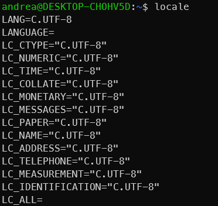

[Home](../index.md)
# [ROS2 installation on Ubuntu](#ros2-installation-on-ubuntu)

In this guide, you will learn how to install ROS2.

__Table of Contents__
* TOC
{:toc}

## [Prerequisites](#prerequisites)

- Open a terminal
- check locale settings by running `locale` command in the terminal. The output should be similar to the following:
      
- If the output is not `en_US.UTF-8`, you need to set the locale to `en_US.UTF-8` by running the following commands:
  
    ```bash
    sudo locale-gen en_US en_US.UTF-8
    sudo update-locale LC_ALL=en_US.UTF-8 LANG=en_US.UTF-8
    export LANG=en_US.UTF-8
    ```

## [1. Setup Sources](#1-setup-sources)

Add the ROS 2 apt repository to your sources list.

```bash
sudo apt update && sudo apt install curl gnupg2 lsb-release
curl -s https://raw.githubusercontent.com/ros/rosdistro/master/ros.asc | sudo apt-key add -
sudo sh -c 'echo "deb [arch=$(dpkg --print-architecture)] http://packages.ros.org/ros2/ubuntu $(lsb_release -cs) main" > /etc/apt/sources.list.d/ros2-latest.list'
```

## [2. Install ROS 2 packages](#2-install-ros-2-packages)

Update the package list and install the ROS 2 packages.

```bash
sudo apt update
sudo apt upgrade
sudo apt install ros-humble-desktop
sudo apt install ros-dev-tools
```

## [3. Environment setup](#3-environment-setup)

Source the ROS 2 setup script to add ROS 2 environment variables to your shell session.

```bash
echo "source /opt/ros/humble/setup.bash" >> ~/.bashrc
echo "source /usr/share/colcon_argcomplete/hook/colcon-argcomplete.bash" >> ~/.bashrc
source ~/.bashrc
```

To test the installation, run the following command:

```bash
ros2 run demo_nodes_cpp talker
```

You should see the following output:

```bash
[INFO] [talker]: Publishing: 'Hello World: 1'
[INFO] [talker]: Publishing: 'Hello World: 2'
[INFO] [talker]: Publishing: 'Hello World: 3'

and so on...
```

in another terminal run the following command:

```bash
ros2 run demo_nodes_py listener
```

You should see the following output:

```bash
[INFO] [listener]: I heard: [Hello World: 1]
[INFO] [listener]: I heard: [Hello World: 2]
[INFO] [listener]: I heard: [Hello World: 3]
and so on...
```

if you see the above output, then the installation was successful.

<!-- ## [4. Next steps](#4-next-steps)

- [Create a ROS 2 workspace](../ros2_workspace/README.md) -->

## [4. References](#4-references)

- [ROS 2 Installation Guide](https://docs.ros.org/en/humble/Installation/Ubuntu-Install-Debs.html)
  