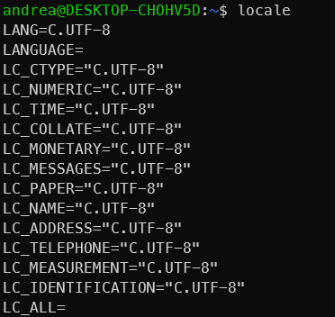

[Home](../index.md)
# [ROS 2 installation on Ubuntu](#ros2-installation-on-ubuntu)

In this guide, you will learn how to install ROS 2.

__Table of Contents__
* TOC
{:toc}

## [Prerequisites](#prerequisites)

- Open a terminal
- Check locale settings by running `locale` command in the terminal. The output should be similar to the following:
      
- If the output is not `en_US.UTF-8`, you need to set the locale to `en_US.UTF-8` by running the following commands:
  
    ```bash
    sudo locale-gen en_US en_US.UTF-8
    sudo update-locale LC_ALL=en_US.UTF-8 LANG=en_US.UTF-8
    export LANG=en_US.UTF-8
    ```

## [1. Setup Sources](#1-setup-sources)

Add the ROS 2 apt repository to your sources list.

```bash
sudo apt update && sudo apt install curl gnupg2 lsb-release software-properties-common

sudo add-apt-repository universe

sudo curl -sSL https://raw.githubusercontent.com/ros/rosdistro/master/ros.key -o /usr/share/keyrings/ros-archive-keyring.gpg

echo "deb [arch=$(dpkg --print-architecture) signed-by=/usr/share/keyrings/ros-archive-keyring.gpg] http://packages.ros.org/ros2/ubuntu $(. /etc/os-release && echo $UBUNTU_CODENAME) main" | sudo tee /etc/apt/sources.list.d/ros2.list > /dev/null
```

## [2. Install ROS 2 packages](#2-install-ros-2-packages)

Update the package list and install the ROS 2 packages.

```bash
sudo apt update
sudo apt upgrade
sudo apt install -y ros-humble-desktop ros-dev-tools
```

## [3. Environment setup](#3-environment-setup)

The `.bashrc` is a text file located in your home directory (also indicated as `~`). It is an hidden file, since its name starts with a dot, that is executed each time you open a new terminal. Let's set it up to activate ROS 2 in each new terminal.

- Open the `.bashrc` file and add the following lines at the end. Use the command `gedit ~/.bashrc` to open the file in a text editor.

    ```bash
    source /opt/ros/humble/setup.bash
    source /usr/share/colcon_argcomplete/hook/colcon-argcomplete.bash
    ```

- To test the installation, run the following command in a new terminal:

    ```bash
    ros2 run demo_nodes_cpp talker
    ```

    You should see the following output:

    ```bash
    [INFO] [talker]: Publishing: 'Hello World: 1'
    [INFO] [talker]: Publishing: 'Hello World: 2'
    [INFO] [talker]: Publishing: 'Hello World: 3'

    and so on...
    ```

- In another terminal run the following command:

    ```bash
    ros2 run demo_nodes_py listener
    ```

    You should see the following output:

    ```bash
    [INFO] [listener]: I heard: [Hello World: 1]
    [INFO] [listener]: I heard: [Hello World: 2]
    [INFO] [listener]: I heard: [Hello World: 3]
    and so on...
    ```

If you see the above output, then the installation was successful.

<!-- ## [4. Next steps](#4-next-steps)

- [Create a ROS 2 workspace](../ros2_workspace/README.md) -->

## [4. References](#4-references)

- [ROS 2 Installation Guide](https://docs.ros.org/en/humble/Installation/Ubuntu-Install-Debs.html)
  