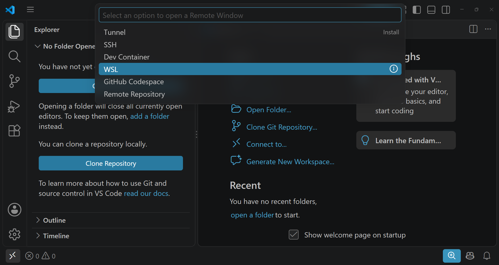
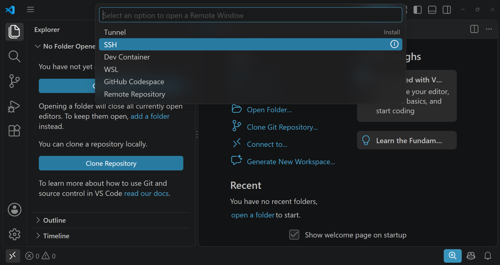
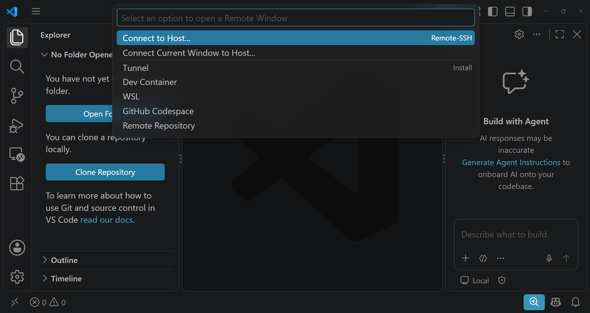
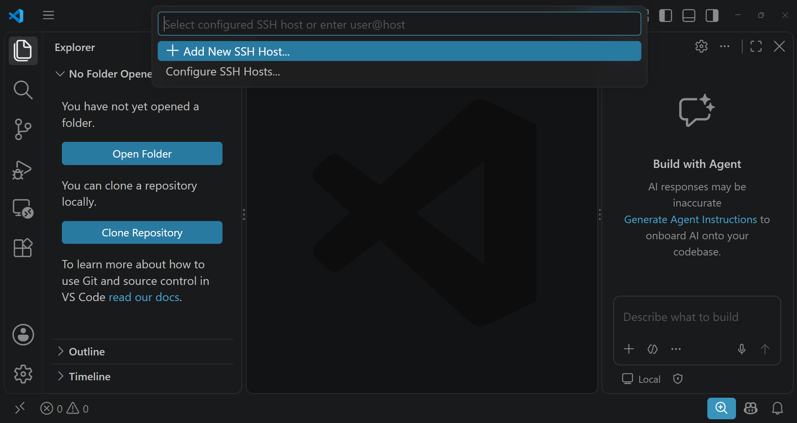
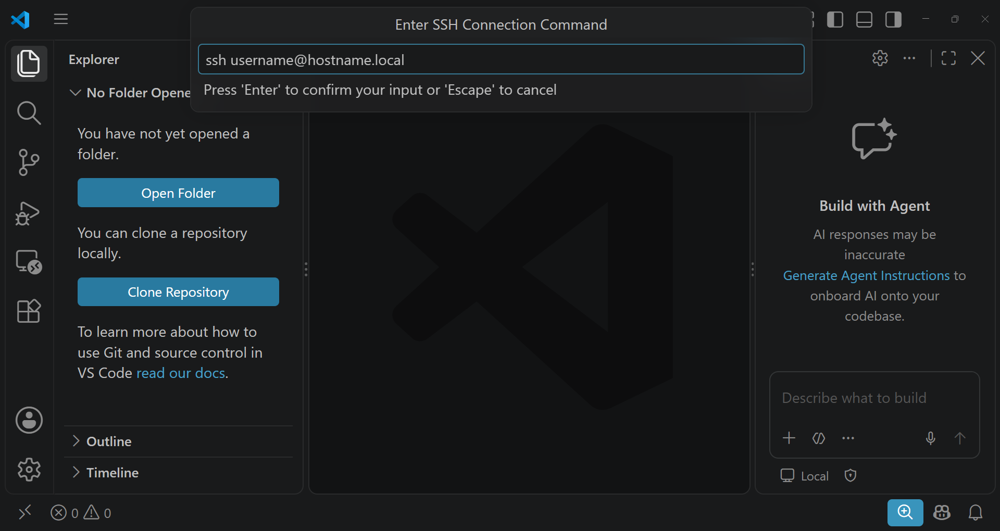
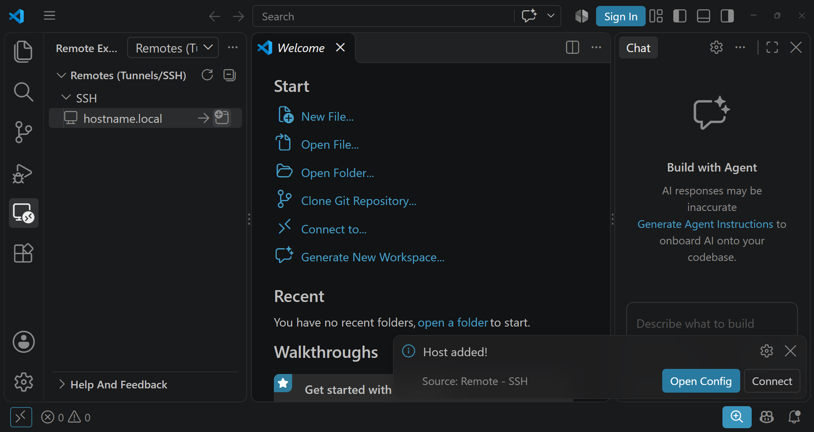

[Home](../index.md)

# Connect VS Code to a Remote

* TOC
{:toc}

## Connect to WSL 2



## Connect to UTM using SSH

Install OpenSSH server on Ubuntu.

```bash
sudo apt update
sudo apt install openssh-server
```

Click on the symbol  in the bottom left corner. Then select `SSH`.




VS Code will automatically install the needed extension. Then click again on the symbol and select `Connect to Host...`.



In the drop down menu, select the option `Add New SSH Host...`



In the input prompt type `ssh username@hostname.local`. **Substitute `username@hostname` with what you see in your Ubuntu terminal written in green.**

Follow the instruction in the VS Code window and press enter to confirm. 



Now, select the Remote Explorer tab and the connection you just added shall be in the list. Click on the icons near the name you added to open the connection in the same window or in a new window.




