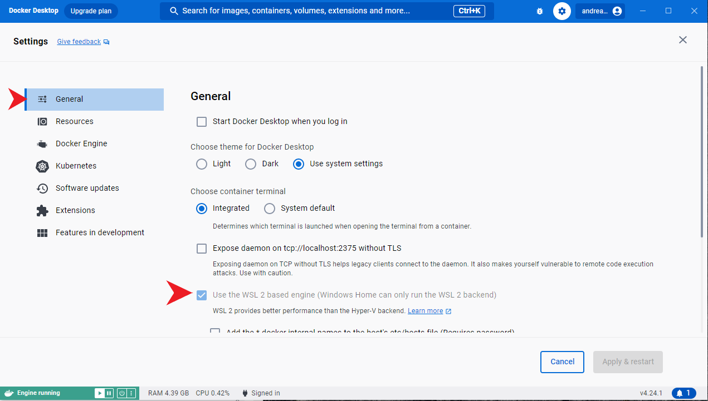
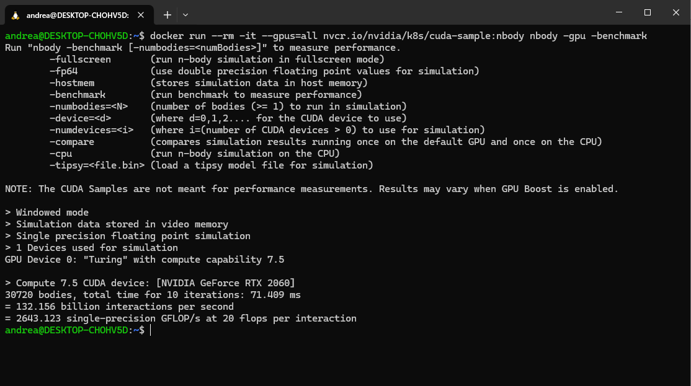

[Home](../index.md)

# Docker Desktop installation (Windows)

install Docker Desktop for Windows with WSL2 backend.

## Steps

- [Docker Desktop installation (Windows)](#docker-desktop-installation-windows)
  - [Steps](#steps)
  - [Prerequisites](#prerequisites)
  - [1. Docker Desktop installation](#1-docker-desktop-installation)
  - [2. Install interactively](#2-install-interactively)
    - [2.1 Additional steps for non-admin users](#21-additional-steps-for-non-admin-users)
  - [Configure Docker Desktop](#configure-docker-desktop)
  - [3. GPU support (optional)](#3-gpu-support-optional)
  - [3. Next steps](#3-next-steps)
  - [3. References](#3-references)

## Prerequisites

- WSL version 1.1.3.0 or later (previously installed)

## 1. Docker Desktop installation

Download and install Docker Desktop for Windows from [here](https://www.docker.com/products/docker-desktop)

## 2. Install interactively

Install the Docker Desktop WSL 2 backend using the interactive installation:

- Double-click Docker Desktop Installer.exe to run the installer.

- Ensure the Use WSL 2 instead of Hyper-V option on the Configuration page is selected.

- If your system only supports one of the two options, you will not be able to select which backend to use.

- Follow the instructions on the installation wizard to authorize the installer and proceed with the install.

- When the installation is successful, select Close to complete the installation process.

### 2.1 Additional steps for non-admin users

If your admin account is different to your user account, you must add the user to the docker-users group:

- Run Computer Management as an administrator and navigate to Local Users and Groups > Groups > docker-users.
- Right-click to add the user to the group.
- Sign out and sign back in for the changes to take effect.

## Configure Docker Desktop

- Start Docker Desktop from the Windows Start menu.
- Select Settings to configure Docker Desktop (the gear).


- Ensure that "Use the WSL 2 based engine" is checked in Settings > General, if not, check it and click Apply & Restart.



Select from your installed WSL 2 distributions which you want to enable Docker integration on (Ubuntu-22.04 or Ubuntu) by going to: Settings > Resources > WSL Integration.


Now docker commands work from Windows using the new WSL 2 engine.

To test it, open a Ubuntu terminal and run:

```bash
docker --version
```


And run a test container:

```bash
docker run hello-world
```


## 3. GPU support (optional)

GPU support is only available in Docker Desktop for Windows with the WSL2 backend.

With Docker Desktop version 3.1.0 and later, WSL 2 GPU Paravirtualization (GPU-PV) on NVIDIA GPUs is supported. To enable WSL 2 GPU Paravirtualization, you need:

- A machine with an NVIDIA GPU
- Beta drivers from NVIDIA supporting WSL 2 GPU Paravirtualization
- Update WSL 2 Linux kernel to the latest version using wsl --update from an elevated command prompt
- Make sure the WSL 2 backend is turned on in Docker Desktop
  
To validate that everything works as expected, run the following command to run a short benchmark on your GPU:

``` bash
docker run --rm -it --gpus=all nvcr.io/nvidia/k8s/cuda-sample:nbody nbody -gpu -benchmark
```

The following displays after downloading the image and running the container:



## 3. Next steps

Install VS Code and the Dev-Containers extensions to use Docker with VS Code, follow the [instructions](./vscode_docker.md)

## 4. References

- [Get started with Docker remote containers on WSL 2](https://learn.microsoft.com/en-us/windows/wsl/tutorials/wsl-containers)
- [Docker Desktop WSL 2 backend on Windows](https://docs.docker.com/desktop/wsl/#download)
- [Develop with Docker and WSL 2](https://docs.docker.com/desktop/wsl/use-wsl/)
  