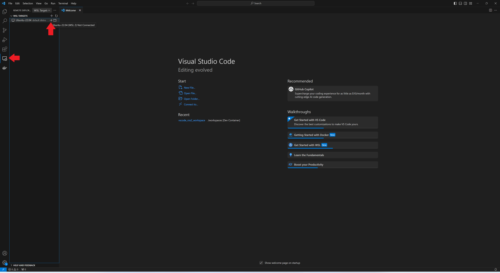

[Home](../index.md)

# [ROS 2 inside dev Container](#ros-2-inside-dev-container)

__Table of Contents__
* TOC
{:toc}

This package will get you set up using ROS 2 with VSCode as your IDE.

## [Prerequisites](#prerequisites)

- Ubuntu 22.04 (installed previously)
- Docker (installed previously)
- Visual Studio Code (installed previously)
- Remote - Containers extension (installed previously)
- Nvidia container toolkit (optionally installed previously)

## [1. Setup VSCode ROS 2 Workspace Template](#1-setup-vscode-ros-2-workspace-template)

Open VSCode and go to the *Remote Explorer* tab. Then, connect to Ubuntu 22.04 clicking on the arrow.



If you have an Nvidia GPU, and Nvidia Docker skip the next steps and go to [1.2](#12-setup-the-template-for-ros-2-nvidia-gpu)


## [1.1 Setup template for ROS 2 (No Nvidia GPU)](#11-setup-template-for-ros-2-no-nvidia-gpu)

### [1.1.1 Clone the repository](#111-clone-the-repository)

Open a terminal inside VSCode and clone the following repository to your local machine:

```bash

cd ~ # Navigate to your home directory (or any other directory of your choice)
## Clone the repository to your local machine (humble branch)
git clone https://github.com/SESASR-Course/vscode_ros2_workspace.git -b humble
```

### [1.1.2 Modify the devcontainer.json](#112-modify-the-devcontainerjson)

Usually using this package the GUI won't show up because the DISPLAY environment variable is not set properly.

In your WSL2 Ubuntu instance

```bash
echo $DISPLAY
```

the output should be something like this:

```bash
:0
```

Open the ```vscode_ros2_workspace/.devcontainer/devcontainer.json``` in the repository and modify the following lines:

```json
"containerEnv": {
    // "DISPLAY": "${localEnv:DISPLAY}", // Needed for GUI try ":0" for windows
    "DISPLAY": ":0", // <-- Paste the value here
   }
```

### [1.1.3 Modify the Dockerfile](#113-modify-the-dockerfile)

Open the ```vscode_ros2_workspace/.devcontainer/Dockerfile``` in the repository and modify the first line:

```bash
FROM althack/ros2:humble-devel  
```

into :

```bash
FROM althack/ros2:humble-gazebo 
```

This will install ROS 2 with Gazebo and other dependencies.

After this step and go to [2. Open the workspace in VSCode using Dev Containers](#2-open-the-workspace-in-vscode-using-dev-containers)

## [1.2 Setup the template for ROS 2 (Nvidia GPU)](#12-setup-the-template-for-ros-2-nvidia-gpu)
Clone the following repository to your local machine:

```bash

cd ~ # Navigate to your home directory (or any other directory of your choice)
## Clone the repository to your local machine (humble-nvidia branch)
git clone https://github.com/SESASR-Course/vscode_ros2_workspace.git -b humble-nvidia
```
### [1.2.2 Modify the devcontainer.json](#122-modify-the-devcontainerjson)

Usually using this package the GUI won't show up because the DISPLAY environment variable is not set properly.

In your WSL2 Ubuntu instance

```bash
echo $DISPLAY
```

the output should be something like this:

```bash
:0
```

Open the ```vscode_ros2_workspace/.devcontainer/devcontainer.json``` in the repository and modify the following lines:

```json
"containerEnv": {
    // "DISPLAY": "${localEnv:DISPLAY}", // Needed for GUI try ":0" for windows
    "DISPLAY": ":0", // <-- Paste the value here
   }
```

### [1.2.3 Modify the Dockerfile](#123-modify-the-dockerfile)

Open the ```vscode_ros2_workspace/.devcontainer/Dockerfile``` in the repository and modify the first line:

```bash
FROM althack/ros2:humble-cuda-dev  
```

into :

```bash
FROM althack/ros2:humble-cuda-gazebo-nvidia
```

This will install ROS 2 with Gazebo and other dependencies.

## [2. Open the workspace in VSCode using Dev Containers](#2-open-the-workspace-in-vscode-using-dev-containers)

Open the ```vscode_ros2_workspace``` folder in VSCode (File -> Open Folder).

The first time you open the folder in VSCode, you will be prompted to reopen the folder in a container.


Click on **Reopen in Container** to open the folder in a container.

If you don't see the pop-up, click on the little green square in the bottom left corner, which should bring up the container dialog


In the dialog, select ***"Remote Containers: Reopen in container"*** or press ```Ctrl + Shift + P``` and type ***"Remote Containers: Reopen in container"***

VSCode will build the dockerfile inside of .devcontainer for you. If you open a terminal inside VSCode (Terminal->New Terminal), you should see that your username has been changed to ros, and the bottom left green corner should say "Dev Container" it may take a few minutes to build the first time.


Congratulations! You are now running ROS 2 inside a container!

## [2.1. Verify ROS 2 installation](#21-verify-ros-2-installation)

To verify the installation, open a terminal inside VSCode (Terminal->New Terminal) and run the following command:

```bash
ros2 topic list
```

You should see the following output:

```bash
/parameter_events
/rosout
```
