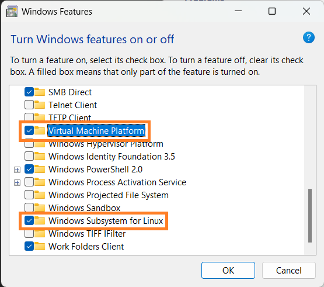
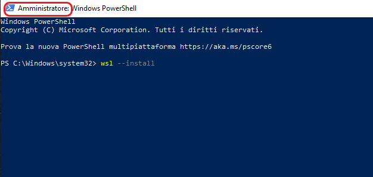
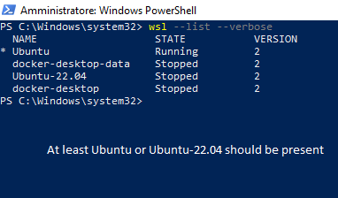
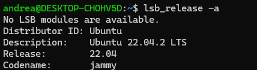
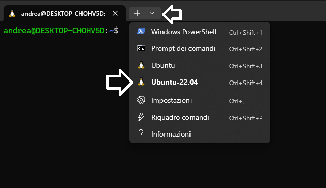
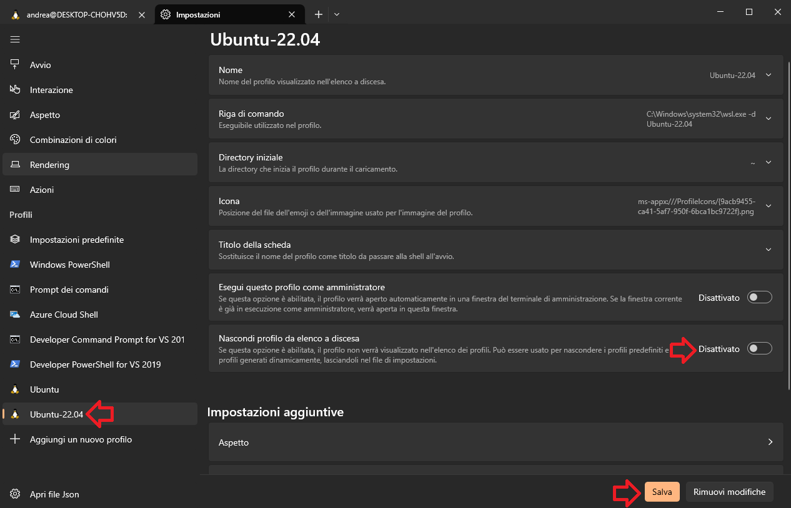

[Home](../index.md)

# [Install Linux on Windows with WSL](#install-linux-on-windows-with-wsl) <!-- omit in toc -->

__Table of Contents__
* TOC
{:toc}

This guide is for installing Ubuntu on WSL (Windows Subsystem for Linux) that lets you run Linux on Windows without using dual boot or traditional virtual machines.

## [Prerequisites](#prerequisites)

- A computer with Windows 10 (version 19041 or higher) or Windows 11.
- Latest graphics drivers. Try with Windows Update or [here](https://learn.microsoft.com/en-us/windows/wsl/tutorials/gui-apps#prerequisites).

## [1. Install WSL command and Ubuntu](#1-install-wsl-command-and-ubuntu)

1. Go to Control Panel > Programs and Features > Turn Windows features on or off. Ensure that __Virtual Machine Platform__ and __Windows Subsystem for Linux__ are both checked then confirm. A reboot may be required at the end of the process.

    

1. Search for PowerShell in the Start menu, then right click on it and __Run as administrator__, type in the following command:

    ``` PowerShell
    wsl --update
    wsl --install -d Ubuntu-22.04
    ```

    

    This command will enable the features necessary to run WSL and install the Ubuntu 22.04 distribution of Linux. You can also install other Linux distributions from the Microsoft Store.

1. Follow the instructions on the screen to **add your username and password** for the Linux distribution.

1. **Reboot your machine** to complete the WSL2 install.

## [2. Verify installation](#2-verify-installation)

1. Open PowerShell or Windows Command Prompt in administrator mode by right-clicking and selecting **Run as administrator**, enter the wsl --list --verbose command to verify that the installation was successful.

    ``` PowerShell
    wsl --list --verbose
    ```

    

2. To start Ubuntu, search for Ubuntu in the Start menu and click on the Ubuntu 22.04 app. Then, verify Ubuntu version entering the following command in the Ubuntu terminal.

    ``` bash
    lsb_release -a
    ```

    

## [3. Install Windows Terminal (optional)](#3-install-windows-terminal-optional)

Windows Terminal is a new, modern, feature-rich, productive terminal application for command-line users. If you don't have it installed, you can install it from the Microsoft Store.


To open Ubuntu in Windows Terminal, click on the down arrow and select Ubuntu 22.04.



If you don't see the Ubuntu profile click on the down arrow and select Settings or press ```Ctrl + ,``` and do the following:



## [4. Increase available memory (optional)](#4-increase-available-memory-optional)

WSL 2 defaults at using half of the RAM installed in your computer, for example if you have 8 GB of RAM the Linux Subsystem can use only 4 GB. If you need to increase this value because, for example, some ROS 2 packages will need more RAM to build, perform the following operations.

1. In a PowerShell window type the following command, this will open the file `.wslconfig` in a Notepad windows so that you can edit it.
    ```powershell
    New-Item $env:USERPROFILE/.wslconfig -type file -Force; notepad.exe $env:USERPROFILE/.wslconfig
    ```

1. Add the following lines to the just opened file and save it.
    ```conf
    [wsl2]
    memory=8GB # you can put as much as you want, up to the maximum installed in your system
    ```

1. Restart WSL system typing the following line in a PowerShell window.
    ```powershell
    wsl --shutdown
    ```

## [5. Next step](#5-next-step)

<!-- [Install Docker Desktop](docker_installation.md)  -->
[ROS 2 Installation](./ros2_installation.md)

## [6. References](#6-references)

- [Install WSL on Windows 10](https://docs.microsoft.com/en-us/windows/wsl/install-win10)
