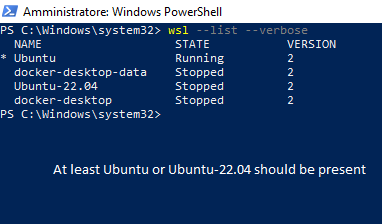
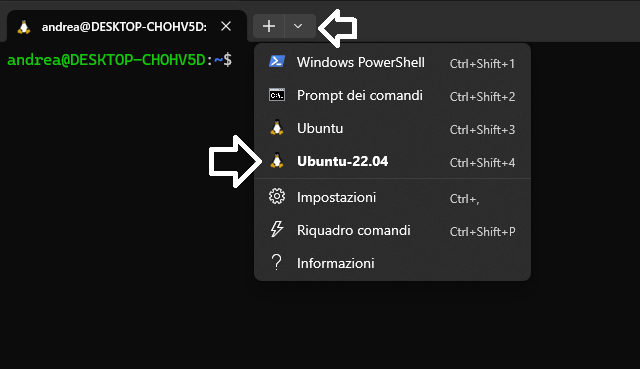
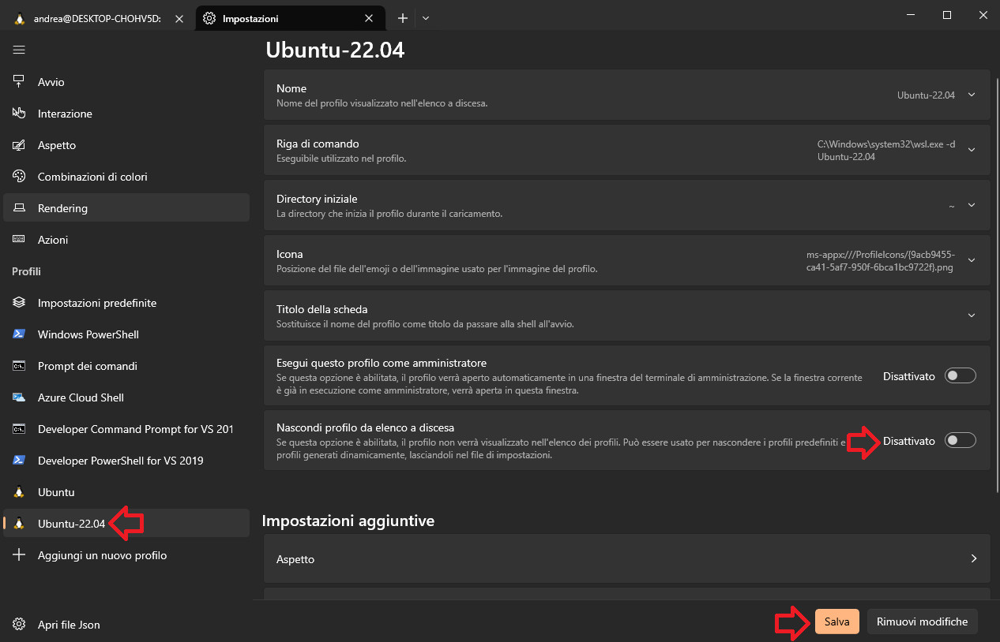

[Home](../index.md)

* TOC
{:toc}

# Install Linux on Windows with WSL

This guide is for installing Ubuntu on WSL (Windows Subsystem for Linux) that lets you run Linux on Windows without using dual boot or traditional virtual machines.

## Prerequisites

- A computer with Windows 10 (version 19041 or higher) or Windows 11.
- Latest graphics drivers. Try with Windows Update or [here](https://learn.microsoft.com/en-us/windows/wsl/tutorials/gui-apps#prerequisites).

## 1. Install WSL command and Ubuntu

Open PowerShell or Windows Command Prompt in administrator mode by right-clicking and selecting **Run as administrator**, enter the wsl --install command, then restart your machine.

```PowerShell
Enable-WindowsOptionalFeature -Online -FeatureName Microsoft-Windows-Subsystem-Linux
```

``` PowerShell
wsl --install -d Ubuntu-22.04
```


This command will enable the features necessary to run WSL and install the Ubuntu 22.04 distribution of Linux. You can also install other Linux distributions from the Microsoft Store.

Follow the instructions on the screen to **add your username and password** for the Linux distribution.

**Reboot your machine** to complete the WSL2 install.

## 2. Verify installation

Open PowerShell or Windows Command Prompt in administrator mode by right-clicking and selecting **Run as administrator**, enter the wsl --list --verbose command to verify that the installation was successful.

``` PowerShell
wsl --list --verbose
```



You can also open the Microsoft Store and search for Ubuntu to verify that the installation was successful.

To start Ubuntu, search for Ubuntu in the Start menu and click on the Ubuntu 22.04 app.

To verify Ubuntu version, enter the following command in the Ubuntu terminal.

``` bash
lsb_release -a
```


## 3. Install Windows Terminal (optional)

Windows Terminal is a new, modern, feature-rich, productive terminal application for command-line users. If you don't have it installed, you can install it from the Microsoft Store.


To open Ubuntu in Windows Terminal, click on the down arrow and select Ubuntu 22.04.



If you don't see the Ubuntu profile click on the down arrow and select Settings or press ```Ctrl + ,``` and do the following:



## 4. Next steps

[Install Docker Desktop](docker_installation.md)

## 5. References

- [Install WSL on Windows 10](https://docs.microsoft.com/en-us/windows/wsl/install-win10)
